# SkillSpring Analytics Architecture

Status: Week 1 foundation approved 2026-08-28; staging expansion validated 2026-09-02

## Purpose

This document explains how SkillSpring's approved synthetic source contract becomes tested analytical data. It distinguishes the current working architecture from layers planned for later weeks.

## Current and planned flow

```mermaid
flowchart LR
    subgraph localCode["Version-controlled project"]
        contract["Approved contract and schemas"]
        generator["Python data generator"]
        validator["Python data validator"]
        loader["BigQuery raw-data loader"]
        sources["dbt source declarations"]
        models["Five dbt staging models"]
        checks["dbt tests and validation SQL"]
        evidence["Validation evidence"]
    end

    subgraph localData["Ignored local output"]
        csvFiles["Nine synthetic CSV files"]
    end

    subgraph warehouse["BigQuery project: skillspring-analytics, EU"]
        rawData["skillspring_raw: nine physical tables"]
        stagingViews["skillspring_analytics: five staging views"]
    end

    subgraph planned["Planned later weeks"]
        intermediate["Intermediate models"]
        marts["Analytical marts and governed metrics"]
        pythonAnalysis["Python analysis and experiment"]
        dashboard["Dashboard and case study"]
    end

    contract -->|"Controls generation"| generator
    generator -->|"Writes"| csvFiles
    csvFiles -->|"Checks rows and relationships"| validator
    csvFiles -->|"Loads with explicit schemas"| loader
    contract -->|"Supplies schemas"| loader
    loader -->|"Creates raw tables"| rawData
    rawData -->|"Referenced by"| sources
    sources -->|"Feeds"| models
    models -->|"Creates views"| stagingViews
    rawData -->|"Validated by"| checks
    stagingViews -->|"Validated by"| checks
    checks -->|"Documents results"| evidence
    stagingViews -.->|"Future input"| intermediate
    intermediate -.-> marts
    marts -.-> pythonAnalysis
    pythonAnalysis -.-> dashboard
```

Solid connections represent current working lineage. Dotted connections represent planned work and must not be interpreted as completed models or outputs.

## Layer responsibilities

| Component | Location | Responsibility | Persistence |
|---|---|---|---|
| Source contract and schemas | Repository | Define grains, keys, controlled values, relationships, and generation rules | Version controlled |
| Generated CSV files | Ignored local `data/generated/` directory | Reproducible warehouse-loading inputs | Local and disposable |
| Raw layer | BigQuery `skillspring_raw` | Preserve source-shaped synthetic records across nine entities | Nine physical tables |
| dbt source declarations | Repository | Register raw-table addresses, descriptions, and lineage without copying data | Version controlled metadata |
| Staging layer | BigQuery `skillspring_analytics` | Apply light, reusable, grain-preserving transformations | Five logical views |
| Tests and validation | Repository plus BigQuery execution | Detect grain, relationship, accepted-value, and transformation failures | Version-controlled tests and evidence |

## Current dbt lineage

| Raw source | Staging view | Preserved grain | Added logic |
|---|---|---|---|
| `skillspring_raw.customers` | `skillspring_analytics.stg_customers` | One row per customer | Signup date and governed reporting region |
| `skillspring_raw.plans` | `skillspring_analytics.stg_plans` | One row per plan version | Exact euro price and current-version flag |
| `skillspring_raw.subscriptions` | `skillspring_analytics.stg_subscriptions` | One row per subscription | Historical paid-conversion and current-cancellation flags |
| `skillspring_raw.invoices` | `skillspring_analytics.stg_invoices` | One row per invoice | Exact euro amount and paid-status flag |
| `skillspring_raw.payment_attempts` | `skillspring_analytics.stg_payment_attempts` | One row per payment attempt | Exact euro amount plus retry and success flags |

The remaining four raw sources are declared in dbt but do not yet have staging models.

## Modeling boundary

Each current staging model reads one raw source and preserves that source's grain. For example, `stg_payment_attempts` reads `payment_attempts`; it retains `invoice_id` from the attempt row but does not join the invoices table.

Week 2 has added grain-preserving plan and invoice staging models. Refund staging comes next, before deliberate cross-entity joins are introduced in intermediate models. This boundary keeps cleaning logic separate from business combinations and reduces the risk of duplicating one-row-per-invoice amounts across multiple payment-attempt rows.

## Reproducibility and security

- The contract, generator, explicit BigQuery schemas, loader, dbt models, tests, and validation SQL are version controlled.
- Generated CSV files are excluded from Git because they are large and reproducible from the fixed seed and tracked generator.
- Local virtual environments, Google credentials, dbt profiles, and cloud tooling are excluded from Git.
- BigQuery datasets use the EU location and contain only fictional synthetic activity.
- Raw data is treated as immutable; governed transformations are created in the separate analytics dataset.

## Validation evidence

- The full generator produced 2,512,863 rows across nine entities using seed `20260827`.
- Local validation passed 11 independent groups with zero errors.
- Warehouse raw validation passed 27 checks.
- The expanded dbt build created five staging views and passed 28 generic tests (`PASS=33 WARN=0 ERROR=0 SKIP=0`).
- Independent staging checks confirmed preserved plan and invoice grains, exact euro conversions, consistent status flags and timestamps, valid invoice periods, and positive billed amounts.

Detailed evidence is available in `raw-data-load-validation.md` and `dbt-staging-validation.md`.
