# SkillSpring Analytics Architecture

Status: Week 1 foundation approved 2026-08-28; three-layer dbt lineage validated 2026-09-03

## Purpose

This document explains how SkillSpring's approved synthetic source contract becomes tested analytical data. It distinguishes the current working architecture from layers planned for later weeks.

## Current and planned flow

```mermaid
flowchart LR
    subgraph localCode["Version-controlled project"]
        contract["Approved contract and schemas"]
        generator["Python data generator"]
        validator["Python data validator"]
        loader["BigQuery raw-data loader"]
        sources["dbt source declarations"]
        models["Eight dbt models across three layers"]
        checks["Generic tests, singular tests, and validation SQL"]
        evidence["Validation evidence"]
    end

    subgraph localData["Ignored local output"]
        csvFiles["Nine synthetic CSV files"]
    end

    subgraph warehouse["BigQuery project: skillspring-analytics, EU"]
        rawData["skillspring_raw: nine physical tables"]
        stagingViews["skillspring_analytics: six staging views"]
        invoiceOutcomes["Invoice-grain payment outcomes"]
        recoveryMart["Daily payment-recovery mart"]
    end

    subgraph planned["Planned later weeks"]
        dimensional["Additional dimensional and metric models"]
        pythonAnalysis["Python analysis and experiment"]
        dashboard["Dashboard and case study"]
    end

    contract -->|"Controls generation"| generator
    generator -->|"Writes"| csvFiles
    csvFiles -->|"Checks rows and relationships"| validator
    csvFiles -->|"Loads with explicit schemas"| loader
    contract -->|"Supplies schemas"| loader
    loader -->|"Creates raw tables"| rawData
    rawData -->|"Referenced by"| sources
    sources -->|"Feeds"| models
    models -->|"Creates views"| stagingViews
    stagingViews -->|"Aggregated safely"| invoiceOutcomes
    invoiceOutcomes -->|"Grouped by invoice date"| recoveryMart
    rawData -->|"Validated by"| checks
    stagingViews -->|"Validated by"| checks
    invoiceOutcomes -->|"Validated by"| checks
    recoveryMart -->|"Reconciled by"| checks
    checks -->|"Documents results"| evidence
    recoveryMart -.->|"Future input"| dimensional
    dimensional -.-> pythonAnalysis
    pythonAnalysis -.-> dashboard
```

Solid connections represent current working lineage. Dotted connections represent planned work and must not be interpreted as completed models or outputs.

## Layer responsibilities

| Component | Location | Responsibility | Persistence |
|---|---|---|---|
| Source contract and schemas | Repository | Define grains, keys, controlled values, relationships, and generation rules | Version controlled |
| Generated CSV files | Ignored local `data/generated/` directory | Reproducible warehouse-loading inputs | Local and disposable |
| Raw layer | BigQuery `skillspring_raw` | Preserve source-shaped synthetic records across nine entities | Nine physical tables |
| dbt source declarations | Repository | Register raw-table addresses, descriptions, and lineage without copying data | Version controlled metadata |
| Staging layer | BigQuery `skillspring_analytics` | Apply light, reusable, grain-preserving transformations | Six logical views |
| Intermediate layer | BigQuery `skillspring_analytics` | Aggregate attempts and refunds safely to one row per invoice and classify outcomes | One logical view |
| Mart layer | BigQuery `skillspring_analytics` | Publish daily invoice-cohort payment, recovery, refund, and EUR metrics | One logical view |
| Tests and validation | Repository plus BigQuery execution | Detect grain, relationship, accepted-value, and transformation failures | Version-controlled tests and evidence |

## Current dbt lineage

| Raw source | Staging view | Preserved grain | Added logic |
|---|---|---|---|
| `skillspring_raw.customers` | `skillspring_analytics.stg_customers` | One row per customer | Signup date and governed reporting region |
| `skillspring_raw.plans` | `skillspring_analytics.stg_plans` | One row per plan version | Exact euro price and current-version flag |
| `skillspring_raw.subscriptions` | `skillspring_analytics.stg_subscriptions` | One row per subscription | Historical paid-conversion and current-cancellation flags |
| `skillspring_raw.invoices` | `skillspring_analytics.stg_invoices` | One row per invoice | Exact euro amount and paid-status flag |
| `skillspring_raw.payment_attempts` | `skillspring_analytics.stg_payment_attempts` | One row per payment attempt | Exact euro amount plus retry and success flags |
| `skillspring_raw.refunds` | `skillspring_analytics.stg_refunds` | One row per refund transaction | Exact euro amount with governed payment-attempt lineage and refund reasons |

| Upstream models | Downstream model | Resulting grain | Added logic |
|---|---|---|---|
| `stg_invoices`, `stg_payment_attempts`, `stg_refunds` | `int_invoice_payment_outcomes` | One row per invoice | Attempt and refund aggregation, payment outcome, refund status, and net collected amount |
| `int_invoice_payment_outcomes` | `mart_payment_recovery_daily` | One row per invoice issue date | Daily volumes, collection and recovery rates, refunds, and gross/net EUR totals |

The remaining three raw sources are declared in dbt but do not yet have staging models.

## Modeling boundary

Each current staging model reads one raw source and preserves that source's grain. For example, `stg_payment_attempts` reads `payment_attempts`; it retains `invoice_id` from the attempt row but does not join the invoices table.

Week 2 added grain-preserving plan, invoice, and refund staging models, then combined entities at invoice grain in `int_invoice_payment_outcomes`. Payment attempts are aggregated by invoice and refunds are linked to their successful attempts before either summary joins invoices. This boundary keeps cleaning logic separate from business combinations and prevents one-row-per-invoice amounts from multiplying across payment-attempt or refund rows. `mart_payment_recovery_daily` then aggregates the safe invoice-grain result by invoice issue date.

## Reproducibility and security

- The contract, generator, explicit BigQuery schemas, loader, dbt models, tests, and validation SQL are version controlled.
- Generated CSV files are excluded from Git because they are large and reproducible from the fixed seed and tracked generator.
- Local virtual environments, Google credentials, dbt profiles, and cloud tooling are excluded from Git.
- BigQuery datasets use the EU location and contain only fictional synthetic activity.
- Raw data is treated as immutable; governed transformations are created in the separate analytics dataset.

## Validation evidence

- The full generator produced 2,512,863 rows across nine entities using seed `20260827`.
- Local validation passed 11 independent groups with zero errors.
- Warehouse raw validation passed 27 checks.
- The full dbt build created eight views across staging, intermediate, and mart layers and passed 74 generic plus two singular tests (`PASS=84 WARN=0 ERROR=0 SKIP=0`).
- Independent staging checks confirmed preserved plan, invoice, and refund grains; exact euro conversions; consistent statuses and timestamps; valid invoice periods; positive amounts; successful refund parents; and no over-refunded payments.
- The invoice-grain model retained 128,633 rows and 128,633 distinct invoice IDs, with zero attempt, status, outcome, refund, or net-amount mismatches.
- The daily mart retained all 128,633 invoices across 532 unique invoice dates, with zero daily formula, rate, financial, or cross-layer reconciliation differences.
- `dbt docs generate` cataloged all eight models and 76 tests; visual review confirmed model descriptions, column documentation, tests, and raw-to-mart lineage.

Detailed evidence is available in `raw-data-load-validation.md` and `dbt-staging-validation.md`.
