# Week 1 Foundation Review

Status: Readiness explanations and the Week 2 handoff were reviewed with Faisal on 2026-08-30; pull request #3 and post-merge CI both passed.

## Week 1 objective

Establish one production-style subscription analytics project with a public repository, a documented source contract, a working BigQuery/dbt foundation, tested staging lineage, and a controlled Git/GitHub review workflow.

## Current system

```mermaid
flowchart LR
    contract["Business problem and source contract"] --> generator["Deterministic Python generator"]
    generator --> raw["BigQuery skillspring_raw: 9 tables"]
    raw --> sources["dbt: 9 declared sources"]
    sources --> staging["BigQuery skillspring_analytics: 3 staging views"]
    staging --> tests["14 dbt tests and 9 independent staging checks"]
    tests --> git["Git feature branch and pull-request review"]
    git --> ci["Credential-free GitHub CI"]
    ci -.-> week2["Week 2: additional staging, intermediate and mart models"]
```

Live data remains in BigQuery. GitHub stores the definitions used to reproduce, transform, test, document, and review the system; it does not store the generated CSVs, private profiles, credentials, or live warehouse objects.

## Verified evidence

| Area | Evidence at the end of Week 1 |
|---|---|
| Business boundary | One SkillSpring subscription product, three stakeholder decision owners, five analytical questions, explicit scope exclusions, nine canonical entities, and defined grains |
| Deterministic source data | 2,512,863 synthetic rows generated with seed `20260827`; full data passed 11 independent validation groups |
| BigQuery raw layer | Nine physical tables in EU dataset `skillspring_raw`; 27 warehouse checks passed |
| dbt source layer | Nine raw sources declared in `_sources.yml` |
| dbt staging layer | Three grain-preserving views: `stg_customers`, `stg_subscriptions`, and `stg_payment_attempts` |
| dbt tests | Fourteen generic tests passed; the last authenticated staging build reported `PASS=17 WARN=0 ERROR=0 SKIP=0` across three models and fourteen tests |
| Independent staging validation | Nine warehouse checks passed for row counts and transformation logic |
| Version control | Public GitHub repository, focused commits, feature branches, reviewed diffs, and two merged pull requests |
| Automated validation | Pull-request and post-merge GitHub Actions runs both passed for the credential-free repository workflow |
| Security boundary | Generated data, private dbt profile, cloud credentials, local tools, virtual environment, and build artifacts remain excluded from Git |

## Validation layers and their limits

| Validation | What it proves | What it does not prove |
|---|---|---|
| Python syntax check | Python files can be parsed | The business logic produces correct outcomes |
| JSON schema validation | BigQuery schema files are valid JSON | Loaded rows comply with every business relationship |
| Deterministic smoke test | A small dataset follows the main generation and validation path | The complete 2.5-million-row dataset or live warehouse is correct |
| `dbt parse` | dbt can understand project configuration, references, Jinja, and lineage | Model SQL executes successfully or returns correct BigQuery rows |
| `dbt build` | Selected models execute and their associated dbt tests pass | Every unstated business assumption is correct |
| Independent SQL checks | Important row counts, relationships, and transformation rules reconcile | Every possible future metric is valid |
| Pull-request review | Scope, intent, impact, evidence, and risks are visible before merge | Human reviewers cannot overlook a logical error |

## Week 1 readiness explanations

These answers must reflect Faisal's own understanding rather than a memorized definition.

### 1. Why analytics code needs version control

Faisal's explanation: analytics SQL should be stored in Git and changed on a feature branch so the team can verify the proposed logic and confirm that the resulting view works and shows the correct numbers before merging it into trusted `main`. The pull request exposes the exact difference and its validation evidence. After merge, commit history preserves both the earlier and revised logic, allowing an unexpected metric change to be traced and, when necessary, reversed.

### 2. How a dbt model is built

Faisal's explanation, corrected through review: raw payment-attempt rows are stored in BigQuery table `skillspring_raw.payment_attempts`. Git makes the selected feature branch's files available in the local working folder; dbt reads the model SQL, YAML declarations, tests, and project configuration from that folder rather than reading the branch itself. dbt compiles the SQL and asks BigQuery to create `skillspring_analytics.stg_payment_attempts` as a view. It then runs the tests declared for the model and reports their results. Git commit, pull-request review, approval, and merge are separate steps performed after the model and its evidence are reviewed.

### 3. How data flows from a source to a downstream model

Faisal's explanation, corrected through a grain check: an invoice with two failed attempts and one successful attempt has three rows in raw `payment_attempts`. `stg_payment_attempts` preserves that one-row-per-attempt grain, so it also has three rows while standardizing fields such as exact euro amount, retry status, and success status. `int_invoice_payment_outcomes` will aggregate the history to one row per invoice, retaining counts and the actual collection outcome. A downstream daily mart can then aggregate invoice-level results. Joining three attempt rows directly to the invoice and summing its amount would multiply the invoice value threefold even though only one payment succeeded; aggregating to invoice grain first prevents that error.

### 4. What CI proves and what remains outside CI

Faisal's explanation, confirmed through an applied scenario: a green CI result correctly proves that the repository's automated structural and smoke checks passed on GitHub's clean runner; it does not prove that live BigQuery models or business numbers are correct. If CI passes but an authenticated `dbt build` fails because a raw table is missing, the controls are not contradictory: CI validated the credential-free repository path, while `dbt build` tested live model execution and declared tests. Independent BigQuery reconciliation queries and business review remain necessary to validate important totals and meaning.

## Honest limitations at the end of Week 1

- Only three of nine raw sources currently have staging models.
- No intermediate or mart model exists yet.
- CI intentionally does not receive BigQuery credentials and therefore cannot run authenticated warehouse builds.
- dbt model and column documentation has not yet been generated and reviewed through dbt Docs.
- The project does not yet contain governed revenue, conversion, churn, cohort, or retention marts.
- Python analysis, experiment evaluation, dashboard, and final case study remain later deliverables in the same project.

## Approved Week 2 connection

Faisal approved beginning Week 2 with `stg_plans` and `stg_invoices`, preserving one row per plan version and one row per invoice. These views will standardize exact euro amounts, billing periods, invoice outcomes, and plan attributes without joining grains prematurely.

The rest of the Week 2 modeling chain should then add:

1. `stg_refunds` at one row per refund.
2. `int_invoice_payment_outcomes` at one row per invoice, aggregating attempt-level payment history before joining it to invoices.
3. `mart_payment_recovery_daily` at one row per calendar date, suitable for analyzing initial failures, successful retries, permanently failed invoices, and recovered amounts.

This sequence increases the project from three to at least eight dbt models across staging, intermediate, and mart layers while protecting invoice amounts from duplication across multiple payment attempts.
